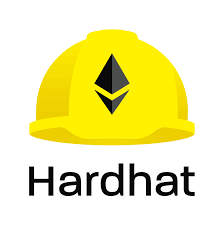

 
 

A NFT marketplace for e-Book. Here, Authors can self publish books. Readers can buy or sell books while compensating the author on every exchange transaction.

## **Our Vision**

We firmly believe that Internet has not just made information sharing smooth and easy but also have promoted people to self-learn from online resources. Among these resources, Wikipedia is a wellspring of information and YouTube being a quick-learn companion. But books not just provide information or short-time learnings but alleviate gaining expertise and thus are more impactful overall.

## **Our Mission**

To further promote self-learning, by making quality books accessible and cheap for all. Smart phones are integral part of present human life and thus we want to leverage it for reading eBooks and saving trees by reducing paper books.

## **What we provide as of now?**

Authors can self publish books, even anonymously, having all freedom and no censorship over the content. It is easier to control market supply and the revenue from sales is directly sent into his/her wallet. Also, they receive 20% compensation for every exchange whenever it occurs. Books can also be distributed for free, wether to publicize or as a donation.

Readers can buy directly from Authors. As the books are being self-published, authors can earn better even by offering books at cheaper prices. Readers can sell books which are less likely to be read again in future, and regaining 80% of the original book cost. Readers get an inbuilt native ebook reader and does not require to use any other dedicated software.

## **Our Roadmap**

- **Implemented** :
  - Authors can publish Books
  - Authors can see stats of every Book
  - Reader buy books from Author or from exchange
  - Native Book Reader
  - Readers can sell the books
  - Free distribution of books
- **Under Development**
  - Renting Books using [Superfluid CFA](https://docs.superfluid.finance/superfluid/docs/constant-flow-agreement)
  - Support for multi-authored books using [Superfluid IDA](https://docs.superfluid.finance/superfluid/protocol-tutorials/perform-an-instant-distribution)
- **Upcoming Milestones** :
  - Author's dashboard and profile
  - Searching and Filtering for Books & Authors
  - Ability to connect with Authors

## **Technologies Used**

&nbsp;&nbsp;&nbsp;

&nbsp;&nbsp;&nbsp;
  

&nbsp;&nbsp;&nbsp;

&nbsp;&nbsp;&nbsp;
&nbsp;&nbsp;&nbsp;
  

&nbsp;&nbsp;&nbsp;

&nbsp;&nbsp;&nbsp;

&nbsp;&nbsp;&nbsp;
  

&nbsp;&nbsp;&nbsp;

&nbsp;&nbsp;&nbsp;

## Initial Setup

- Add **Metamask** to your browser.
- Add Polygon Mumbai Testnet to metamask networks (**Please note, this platform is currently functional only on Polygon Matic Testnet**). Search on **[chainlist.org](https://chainlist.org/)**, click Add to Metamask.
- Add test matic tokens from **[Polygon Faucet](https://faucet.polygon.technology/)**
- Connect to the website and you are good to go.
- To get any book on rent first go to --> **[SuperFluid Dashboard](https://app.superfluid.finance/)** and then connect with the same account from which you want to rent the book. 
- Then deposit some matic to superfluid. And you are good to get any book on rent if available.

## **Developer Team**

- **[Raghav Goyal](https://github.com/rg12301)**
- **[Nonit Mittal](https://github.com/NonitMittal)**
- **[Ishita Gupta](https://github.com/ishitagupta03)**
